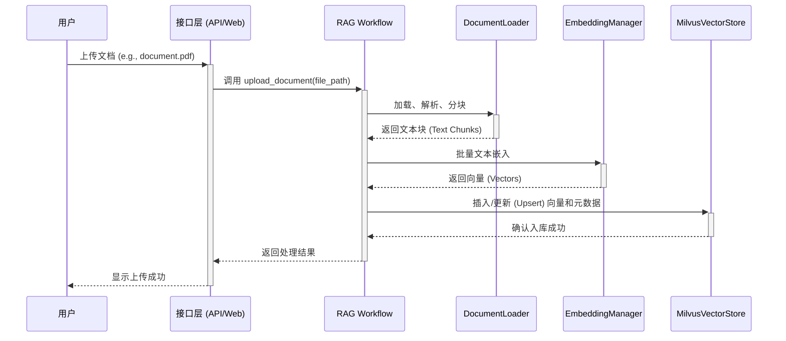
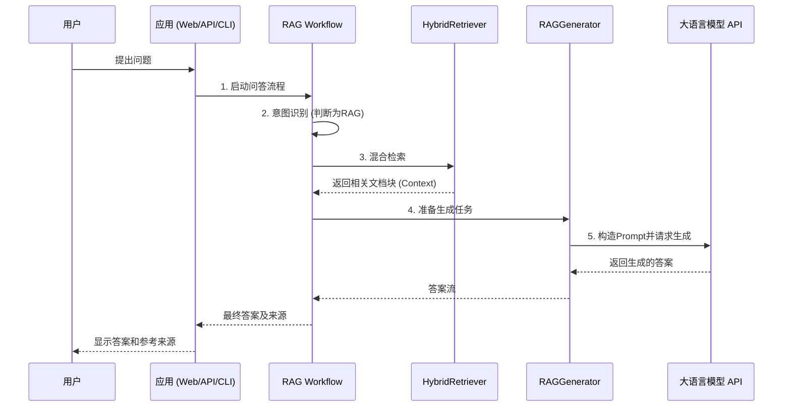

# LLM-Milvus RAG 系统技术说明文档

## 1. 项目简介

本项目是一个基于大语言模型（LLM）和 Milvus 向量数据库的检索增强生成（RAG）智能问答系统。它旨在解决本地知识库的智能问答需求，用户可以上传私有文档，系统会基于这些文档内容，通过自然语言交互的方式提供精准的回答。

系统提供了三种访问方式，以适应不同场景的需求：

- **Web 界面**: 面向普通用户，提供文档管理和实时问答的可视化界面。
- **RESTful API**: 面向开发者，提供标准接口以便于集成到现有应用中。
- **命令行工具 (CLI)**: 面向运维或高级用户，支持脚本化和批量处理任务。

## 2. 核心特性

- **混合检索 (Hybrid Search)**: 结合**稠密向量检索**（理解语义相似度）和**稀疏向量/关键词检索**（匹配精准关键词），通过倒数排序融合（RRF）策略提升检索召回率和精准度。
- **智能意图识别**: 系统能自动判断用户问题的意图，决策是直接进行聊天（Chat 模式），还是需要调用知识库进行检索问答（RAG 模式）。
- **多接口支持**: 通过 FastAPI (API)、Streamlit (Web) 和 Click (CLI) 提供全面的服务。
- **多格式文档处理**: 支持 `.pdf`, `.docx`, `.txt`, `.md` 等多种主流文档格式的自动解析、分块和索引。
- **会话管理**: 支持多轮对话，能够维护对话上下文，并对会话进行持久化管理。
- **模块化与可扩展**: 代码结构清晰，功能高度解耦，易于扩展和维护。

## 3. 技术栈

| 类别                | 技术                   | 描述                                             |
| :------------------ | :--------------------- | :----------------------------------------------- |
| **后端框架**        | FastAPI                | 高性能的 Python Web 框架，用于构建 RESTful API。 |
| **前端框架**        | Streamlit              | 用于快速构建数据应用和可视化界面的 Python 库。   |
| **核心逻辑**        | LangGraph, LangChain   | 用于构建和编排复杂的 LLM 应用，管理 RAG 流程。   |
| **向量数据库**      | Milvus                 | 开源的向量数据库，用于存储和检索文档向量。       |
| **基础设施**        | Docker, Docker Compose | 用于容器化部署 Milvus 及其依赖（etcd, MinIO）。  |
| **大语言模型**      | Kimi / SiliconFlow     | （通过 API 调用）作为生成答案的核心引擎。        |
| **Python 核心依赖** | `pymilvus`             | Milvus 的 Python 客户端。                        |
|                     | `jieba`                | 中文分词库，用于稀疏检索。                       |
|                     | `pydantic`             | 数据验证和模型定义。                             |

## 4. 系统架构

系统采用前后端分离的架构，核心业务逻辑由 LangGraph 工作流驱动，并通过 Milvus 向量数据库提供知识检索能力。

**架构说明**:

1.  **接口层**:
    *   `Streamlit` (`src/web/streamlit_app.py`): 提供用户友好的Web界面。
    *   `FastAPI` (`src/api/app.py`): 暴露所有核心功能的RESTful API端点，是系统集成的主要入口。
    *   `Click` (`src/cli/cli.py`): 提供命令行接口，方便脚本化和批量处理。
    *   这三者相互独立，但都调用下游的`RAG Workflow`来执行核心逻辑。

2.  **编排层**:
    *   `LangGraph` (`src/graph/workflow.py`): 系统的“大脑”，负责定义和执行整个RAG流程。它以图（Graph）的形式将不同的功能节点（如意图识别、检索、生成）连接起来，并根据输入状态（State）决定执行路径，实现了业务逻辑与功能组件的解耦。

3.  **核心逻辑层**:
    *   `Intent Recognizer`: 识别用户输入的意图，判断是普通聊天、知识问答还是文档上传，从而决定工作流的走向。
    *   `Document Loader`: 负责加载和解析不同格式的文档，并将其切割成合适的文本块（Chunk）。
    *   `Hybrid Retriever`: 混合检索器，是RAG效果的关键。它内部包含：
        *   **Dense Retriever**: 调用`Embedding Manager`将查询文本向量化，然后在`Milvus`中进行语义相似度搜索。
        *   **Sparse Retriever**: 基于`jieba`分词和`BM25`算法实现关键词检索。
        *   最后，将两路结果进行加权融合（RRF），得到最终的检索上下文。
    *   `RAG Generator`: 将用户的原始问题和`Hybrid Retriever`检索到的上下文信息组合成一个Prompt，然后调用外部的`Kimi LLM API`生成最终答案。
    *   `Session Manager`: 负责管理多轮对话的上下文历史，将会话数据保存在文件系统中。

4.  **数据存储层**:
    *   `Milvus`: 核心的向量数据库，存储所有文档块的向量嵌入，并提供高速的向量检索能力。通过`docker-compose.yml`部署，依赖`MinIO`（对象存储）和`etcd`（元数据）。
    *   `File System`: 用于存储会话历史等非向量化数据。

5.  **外部服务**:
    *   系统通过API调用外部的LLM（Kimi）和Embedding模型服务（SiliconFlow）。这部分在`config.yaml`中配置，易于替换。

## 5. 数据流

### 5.1 文档上传数据流

当用户上传一份文档时，系统会执行以下步骤将其处理并存入知识库：



### 5.2 问答数据流

当用户提出一个问题时，系统会执行 RAG 流程来生成答案：



## 6. 核心模块解析

项目的核心逻辑代码位于 `src/` 目录下，主要模块职责如下：

-   **`src/api`**:
    -   **`app.py`**: 定义了所有 FastAPI 端点，是系统对外提供服务的 Web 入口。包括文档上传、问答查询、会话管理等接口。

-   **`src/web`**:
    -   **`streamlit_app.py`**: 实现了前端用户界面。用户通过该界面与系统交互，进行文档管理和智能问答。它通过 HTTP 请求调用 `src/api` 提供的后端服务。

-   **`src/graph`**:
    -   **`workflow.py`**: **系统的“大脑”**。使用 LangGraph 构建了核心的 RAG 工作流。它负责编排意图识别、文档处理、检索、生成等步骤。
    -   **`nodes.py`**: 定义了工作流中的各个执行节点（如检索节点、生成节点）。
    -   **`state.py`**: 定义了工作流的状态机，用于在不同节点间传递数据。

-   **`src/retrieval`**:
    -   **`retriever.py`**: 实现了混合检索逻辑。它封装了稠密向量检索和稀疏关键词检索，并使用 RRF 算法对两路结果进行融合排序。

-   **`src/generation`**:
    -   **`generator.py`**: 负责与大语言模型交互。它根据检索到的上下文和用户问题，生成最终的 Prompt，并调用 LLM API 获取答案。

-   **`src/vector_store`**:
    -   **`milvus_store.py`**: 封装了所有与 Milvus 数据库的交互操作，包括集合的创建、数据的增删改查等。

-   **`src/embedding`**:
    -   **`embedder.py`**: 负责将文本块转换为向量表示（Embedding），以便存入 Milvus。

-   **`src/document_loader`**:
    -   **`loader.py`**: 负责加载不同格式的文档，并将其智能地分割成合适的文本块（Chunks）。

-   **`src/conversation`**:
    -   **`session_manager.py`**: 提供了会话管理功能，包括会话的创建、历史记录的存取、持久化等。

## 7. 快速上手指南

请遵循以下步骤来启动和使用本系统。

### 7.1 环境准备

1. **安装依赖并初始化环境**:

   ```bash
   make init-env
   ```

   此命令会安装所有必要的 Python 依赖，并创建 `.env` 文件。

2. **配置 API 密钥**:
   打开项目根目录下的 `.env` 文件，填入你的大模型 API 密钥：

   ```env
   KIMI_API_KEY=your_kimi_api_key
   SILICONFLOW_API_KEY=your_siliconflow_api_key
   ```

### 7.2 启动服务

1. **启动 Milvus 数据库**:

   ```bash
   make docker-up
   ```

   此命令会使用 Docker Compose 在后台启动 Milvus, etcd 和 MinIO 服务。首次启动请耐心等待几分钟。

2. **启动后端 API 服务**:

   ```bash
   make run-api
   ```

   API 服务将在 `http://localhost:8000` 启动。你可以访问 `http://localhost:8000/docs` 查看 Swagger UI 文档。

3. **启动前端 Web 界面**:

   ```bash
   make run-web
   ```

   Web 界面将在 `http://localhost:8501` 启动。

### 7.3 使用示例

- **通过 Web 界面**:

  1.  访问 `http://localhost:8501`。
  2.  在“文档上传”页面上传你的文件。
  3.  切换到“智能问答”或“智能对话”页面，开始提问。

- **通过 API (cURL)**:

  ```bash
  # 上传文档
  curl -X POST -F "file=@/path/to/your/document.pdf" http://localhost:8000/documents/upload
  
  # 提问
  curl -X POST -H "Content-Type: application/json" \
    -d '{"question": "你的问题是什么？"}' \
    http://localhost:8000/query
  ```

- **通过 CLI**:

  ```bash
  # 上传单个文件或整个目录
  python -m src.cli.cli upload ./data/sample_docs/
  
  # 提问
  python -m src.cli.cli query "RAG技术的核心思想是什么？"
  ```

## 8. 配置说明

系统核心配置位于 `config/config.yaml` 文件中，你可以根据需求调整以下关键参数：

-   **`retrieval`**:
    -   `dense_weight`: 稠密检索的权重。
    -   `sparse_weight`: 稀疏检索的权重。
    -   `similarity_threshold`: 检索结果的相似度阈值，低于此值的结果将被过滤。
-   **`document`**:
    -   `chunk_size`: 文档分块的大小（字符数）。
    -   `chunk_overlap`: 相邻块之间的重叠字符数。
-   **`llm`**:
    -   `provider`: 选择使用的大模型提供商（如 `kimi` 或 `siliconflow`）。
    -   `model`: 具体使用的模型名称。
    -   `temperature`: 生成答案时的温度系数，影响创造性。

## 9. 核心 API 端点

系统通过 FastAPI 提供了一系列 RESTful API。以下是几个核心接口：

-   `POST /documents/upload`
    -   **功能**: 上传单个文档文件进行处理和索引。
    -   **参数**: `file` (multipart/form-data)。
    -   **返回**: 上传结果，包括文档信息和处理状态。

-   `POST /query`
    -   **功能**: 执行一次性的 RAG 问答查询。
    -   **参数**: `question` (str), `top_k` (int), `method` (str)。
    -   **返回**: 包含答案、来源文档和性能信息的 JSON 对象。

-   `POST /conversation/stream`
    -   **功能**: 进行流式的、支持多轮对话的智能问答。系统会自动管理会话历史。
    -   **参数**: `question` (str), `session_id` (str, optional)。
    -   **返回**: Server-Sent Events (SSE) 流，实时返回意图、元数据、答案内容和来源。

-   `GET /sessions`
    -   **功能**: 获取当前用户的会话列表。
    -   **返回**: 包含所有会话摘要信息的列表。

-   `GET /sessions/{session_id}`
    -   **功能**: 获取特定会话的详细信息，包括完整的消息历史。
    -   **返回**: 单个会话的详细数据。

